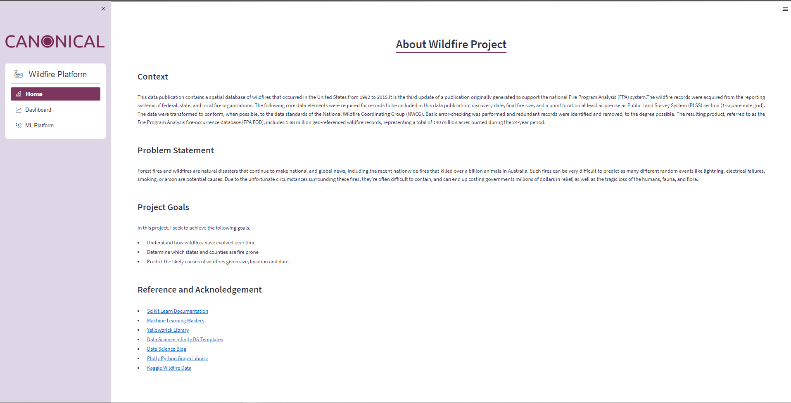
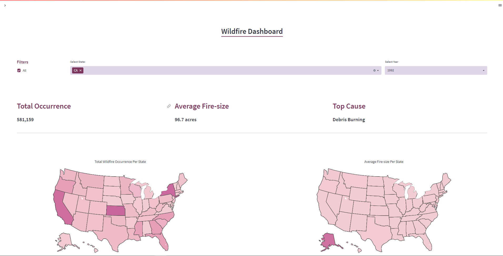
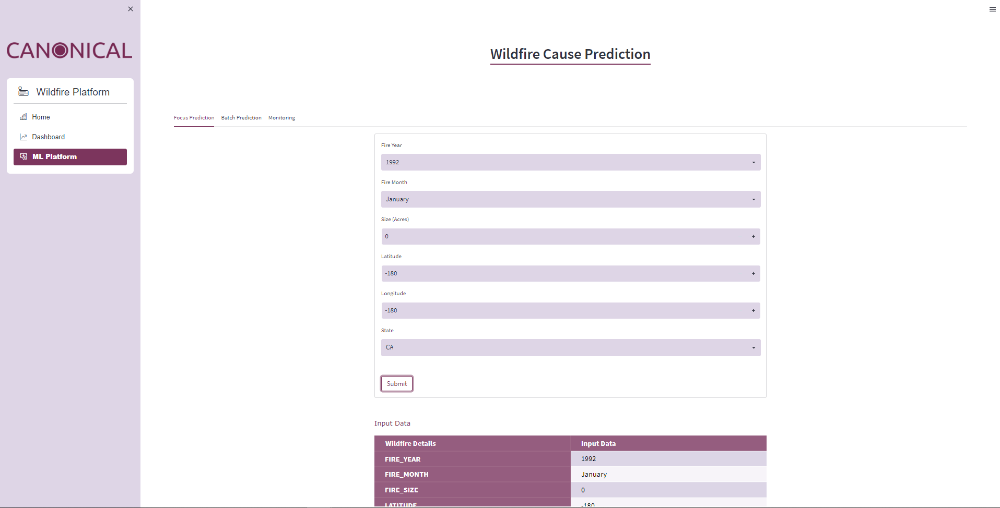
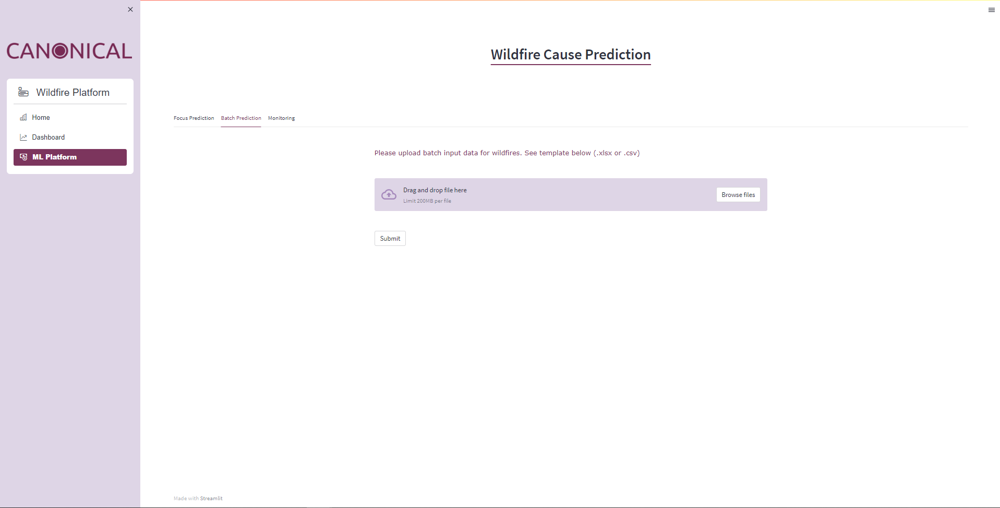

## US Wildfire Analysis Project
<br>

## Table of Contents
* [Installing Packages](#ip)
* [Project Motivation](#pm)
* [File Description](#fd)
* [Methodology](#md)
* [Results](#re)


<br>

## Installing Packages<a name="ip"></a>
<br>

#### Running Jupyter Notebook<a name="jn"></a>
<br>
To run the jupyter notebook on your localhost, I recommend you install the packages I used for this project. You can do that by following the steps I have outlined below. But before that, make sure you have anaconda downloaded and installed;

1. Download the requirements.txt file and save it into the directory you'll be working from.
2. Create a conda environment with python 3.*

	```python

	conda create --name env-name python==3.8
	```
3. Now install the packages from the requirements.txt file. Make sure you're in folder that has the file.

	```python

	pip install requirements.txt
	```
4. Finally, activate the environment and run the cloned/downloaded jupyter notebook

	```python

	conda activate env-name
	```
<br>

#### Running Streamlit App
<br>

1. Clone this repository 
2. Download the sqlite database file [here](https://drive.google.com/file/d/1ppmtt3oxiDxxpCOmBkVgClLyU3of4_Iz/view?usp=sharing) and save it in a folder called `Data`.
3. Add the newly created Data folder to the cloned repository cloned from step 1.
4. Open anaconda prompt and activate the env created from [running jupyter notebook](#jn) face with the dependencies already installed.
5. Once environment is activated, nagivate into the `App` folder using the `cd` command.
6. Finally, type the command below to run the app.

	```python

	streamlit run app.py
	```

<br>


#### Snapshot of App

These are some images of the deployed app


<br>


<br>


<br>


<br>


## Project Motivation<a name="pm"></a>
<details>
	<summary>Problem Statement</summary>
	<br>
	<p style='text-align:justify;'>Forest fires and wildfires are natural disasters that continue to make national and global news, including the recent nationwide fires that killed over a billion animals in Australia. Such fires can be very difficult to predict as many different random events like lightning, electrical failures, smoking, or arson are potential causes. Due to the unfortunate circumstances surrounding these fires, they're often difficult to contain, and can end up costing governments millions of dollars in relief, as well as the tragic loss of the humans, fauna, and flora.

Inspired by this real-world problem, we set out to create a prediction model to evaluate whether United States fires can be contained within their local confines, or may necessarily need external aid. Below are our findings.</p>

</details>

<details>
	<summary>Project Goals</summary>
	<br>
	<p>IIn this project, I seek to achieve the following goals;</p>
	<ol>
		<li>Understand how wildfires have evolved over time</li>
		<li>Determine which states and counties are fire prone</li>
    <li>Predict the likely causes of wildfires given size, location and date.</li>
	</ol>
</details>

<br>

## Repo Description <a name="fd"></a>
This repository contains one Jupyter notebook that has all the code for data cleansing, EDA and machine learning. There is also a python script that contains code for the deployment of ml model. Finally, there is a pickle file which is the trained model.

<br>

## Methodology<a name="md"></a>
<details>
	<summary>Data Quality Assessment</summary>
	<br>
	<p style='text-align:justify;'>The first task that I performed under the data preparation step was initial assessment of the quality of data which easily allowed me to properly clean the data. The following were some of the issues discovered;</p>
	<ul>
		<li>Missing values in some of the columns with 6 of those columns having missing values above 60%.</li>
		<li>Discovered some columns will not be needed for the analysis.</li>
		<li>Some of the data types were not properly formatted including the date.</li>
	</ul>
</details>

<details>
	<summary>Data Cleaning and Preprocessing</summary>
	<br>
	<p style='text-align:justify;'>In the preprocessing step (usually an iterative process) I cleaned the data based on data quality issues identified. Some of           the task I performed in this step include;</p>
	<ul>
		<li>Handling missing values</li>
		<li>Dropping unneeded columns</li>
		<li>Proper date formatting</li>
	</ul>
</details>

<details>
<summary>Exploratory Data Analysis</summary>
<br>
One of the goals for this project as mentioned earlier is to segment dataset and draw unique insights, by answering some questions. Based on this stated goal, I performed any set of analysis to obtain insights that helped me arrive at some plausible conclusions.

<p>&nbsp;</p>
	
To achieve the first goal, I looked at general distirbutions of our features and try to answer the questions listed below:
  
* How has wildfires evolved over time?
* Which states and counties are fire prone?
* What are the main causes of wildfires?
* Predict the likely causes of wildfires given size, location and date.
</details>


<details>
<summary>Predictive Modeling</summary>
<br>
To complete this task I went through the various machine learning steps which includes;
	
* Data Loading - In this task I loaded the cleaned data that contained all the engineered features as well as the selected ones.
* Data Understanding - In this step, I used both graphical and quantitative methods to explore the distributions and correlations between attributes.
* Data Splitting - I then went ahead and split the data into train, test and validation data in readiness for modeling.
* Algorithm Evaluation - In this step, I trained various algorithms on a standardized dataset using default parameters and 5-fold cross-validation. 
* Parameter Tuning - The best model turned out to be RandomForest Classifier which I later went ahead to tune its parameters for better performance using                Grid Search.
* Final Model - At this stage, the model was ready to make predictions. The model was able to predict the causes of wildfire with an `F1` score of approximately 80%
* Model Understanding -  I wanted to know how the trained model performed and what were the main drivers. I plotted various visualizattions including roc/auc curves, classification report, confusion matrix, precision recall curve etc.
</details>

<br>

## Results<a name="re"></a>
Before the beginning of this project, I set out to achieve certain goals based on the dataset we had available. The goals were;

* Understand how wildfires have evolved over time
* Determine which states and counties are fire prone
* Predict the likely causes of wildfires given size, location and date.

At the end of this project, I was able to draw unique insights from the dataset by answering about exploring the dataset and answering some questions. Some of the insights generated were:

#### Data Analysis

* Wildfire occurrence has been increasing almost every `6-5 years` with a few dips. But there was approximately 50% increase in wildfire occurrence between `2005` and `2006`. Upon closer investigation it seems most wildfires occur between `February` and `April`.
* The most devastating impact of wildfire by size occurred in `2012` and `2015` with average fire size of approximately `130` and `138` acres respectively. Even though huge number of wildfire occured in `2006`, the devaasting impact of the fire is lower than other years with less number of occurrences. 
* Before the 21st century, the central part of US and north eastern part were less fire prone as compared to the western part of US with `Georgia` and `California` being the most fire prone. However, the situation changed in the 21st century. As the years progressed, most states became more fire prone with `Texas`, `New York` and `Kansas` recording high values.
* Wildfires had devastating impact in less fire prone states. That is, most states in the north and central part of US experience devastating wildfires with an average size of approximately `1000` acres. 
* The predominant causes of wildfires according to the data originated from `debris burning`, `lightning`, `arson` and other `miscellaneous` activities.
* Even though most wildfire occurrences were caused by debris burning, we can see that they were less devastating than wildfires caused by `lightning` and `powerline`.
* Most wildfire occurrences were contained in less than a day with only `9.72%` of wildfires contained within a day or more.


Based on the insights generated and results from testing some of our assumptions, here some recommendations I came up with.

* Perform hyperparameter tuning 
    * Due to limitations in compute power, I couldn't perform deep hyperparameter tuning to determine optimal paramters for best performance. 
    * This is very important since if I want to make accurate prediction on the various causes of wildfire, then I would need to determine the best parameters to give us a high performing model.

* SMOTE Implementation
    * Based on the dataset that we had, I realize there was an imbalance in some of the classes to be predicted which skewed the performance of the model. I would there need to find ways to balance the classes by either upsampling or downsampling using SMOTE techniques.
    * This will ensure that prediction performance is based on all the classes.
 
<br>


